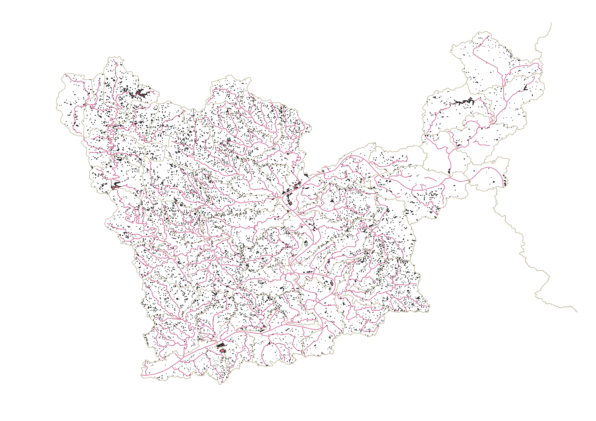

# Middle Ohio-Laughery Watershed Map

## Project Description

This project visualizes the **hydrology of the Middle Ohio–Laughery Watershed** (Hydrologic Unit 8 – 05090203) using the USGS National Hydrography Dataset (NHD). The map displays **flowlines** (streams and rivers) and **waterbodies** (lakes, ponds, reservoirs) in the watershed, providing a tool for interactive exploration, environmental studies, and watershed management analysis.

## Project Contents

- [Data Source](#data-source)
- [Project Background](#project-background)
- [Purpose](#purpose)
- [Planned Mapmaking Process](#planned-mapmaking-process)
- [Expected Map Summary](#expected-map-summary)
- [Final Project Link](#final-project-link)

***

### Data Source

[USGS National Hydrography Dataset (NHD) – Best Resolution](https://www.usgs.gov/national-hydrography) 

* **Initial Data projection:** NHD default (typically NAD83 / UTM zones)  
* **Intended Final Map projection:** WGS84 (EPSG:4326) for web mapping in Mapbox  

---

### Project Background

The Middle Ohio–Laughery Watershed (HU8 05090203) contains a network of rivers, streams, lakes, and other water features that are important for environmental studies, hydrology, and watershed management. Using the NHD dataset, this project visualizes the key hydrological features and prepares them for interactive web mapping.

---

### Purpose

The purpose of this map is to provide a **clear, interactive visualization of watershed hydrology**, highlighting flowlines and waterbodies while demonstrating effective GIS-to-web map workflow using QGIS and Mapbox Studio.

---

### Mapmaking Process

Example of in-process map:  

You can describe the mapmaking process in this section, including images where it helps to describe the process.

Steps in the process:

1. **Collecting and preparing data** – Downloaded NHD shapefiles for HU8 05090203 from USGS, including flowlines and waterbodies.  
2. **Simplifying features** – Simplified geometries in QGIS to reduce file size while preserving hydrological detail.  
3. **Exporting to GeoJSON** – Converted simplified layers to GeoJSON using WGS84 (EPSG:4326) for Mapbox compatibility.  
4. **Uploading to Mapbox** – Uploaded GeoJSON files as tilesets and added them to the Mapbox style.  
5. **Styling features** – 
   - Flowlines rendered as blue lines; waterbodies as filled polygons.  
   - **Labels added** to major waterbodies and flowlines; labels configured to appear **only at closer zoom levels** to avoid clutter.  
6. **Adding contextual layers** – Included state and county boundary layers to provide geographic reference, along with a satellite basemap for context.  
7. **Layer ordering and adjustments** – Ensured water features appear above the basemap but below labels, and verified visibility at different zoom levels.  
8. **Final adjustments and testing** – Reviewed map for clarity, readability, and visual balance.
---

### Map Summary

Key points from the map and mapmaking process:

- Major rivers, streams, and waterbodies in the Middle Ohio–Laughery Watershed are clearly visualized.  
- Labels for flowlines and waterbodies appear only when zoomed in close enough to avoid clutter.  
- State and county layers provide context and help locate features within the watershed.  
- Satellite basemap enhances geographic understanding of the area.  
- The map supports both overview and detailed analysis at different zoom levels.  
- This workflow shows the full process of downloading date, adding it to QGIS adjusting it then adding to Mapbox to make an interactive web map, including steps like simplifying the data, styling features, adding labels, and arranging layers.

---

## Final Project Link

Please view the [final map online](https://username.github.io/ukmap671-final_map_project-2025)

